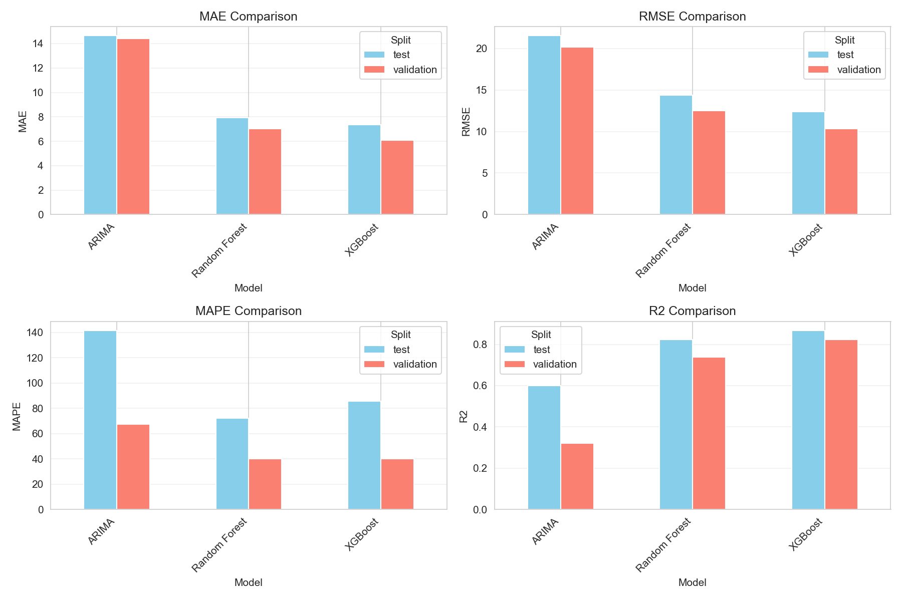
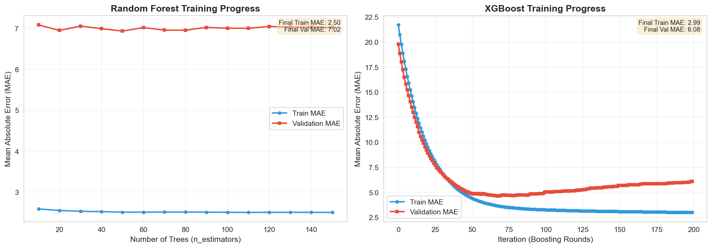

<style>
@page { margin: 1in; }
body { 
  font-family: "Times New Roman", serif; 
  font-size: 11pt; 
  line-height: 1.3; 
  text-align: justify;
}
h1 { font-size: 14pt; margin-top: 0.5cm; margin-bottom: 0.25cm; }
h2 { font-size: 12pt; margin-top: 0.4cm; margin-bottom: 0.2cm; }
h3 { font-size: 11pt; font-style: italic; margin-top: 0.3cm; }
p { margin-bottom: 0.15cm; }
img { max-width: 100%; margin: 0.4cm auto; display: block; }
code { font-family: "Courier New", monospace; font-size: 9pt; }
table { font-size: 10pt; border-collapse: collapse; width: 100%; }
th, td { border: 1px solid #999; padding: 0.15cm; }
</style>

# Predictive Modeling of Property Sale Requisitions in Canton Fribourg

**Author:** Loris Bossel<br>
**Institution:** HEC Lausanne, University of Lausanne  
**Course:** Advanced Programming - Data Science  
**Professor:** Prof. Simon Scheidegger<br>
**Assistant:** Anna Smirnova  
**Date:** December 2025

## Abstract
<div align="center">
<p style="text-align: justify;">This project develops a machine learning forecasting system for property sale requisitions in Canton Fribourg, Switzerland, using 30 years of administrative data from the Swiss Federal Statistical Office. Three modeling approaches are implemented and compared: ARIMA, Random Forest, and XGBoost. The system employs rigorous temporal validation with train (1994-2015), validation (2016-2020), and test (2021-2024) splits to prevent data leakage. Feature engineering creates lag features and cyclical temporal encodings to capture seasonality and delayed effects. XGBoost achieves the best performance on test data, significantly outperforming ARIMA and marginally exceeding Random Forest across multiple evaluation metrics. A rolling forecast system generates monthly predictions for 2025-2026 with dynamic lag feature updates. The implementation demonstrates professional software engineering practices including modular architecture, comprehensive testing, and detailed documentation. The forecasting system provides actionable intelligence for administrative resource planning and early warning of economic stress in the region.</p>
</div>

---

## 1. Introduction

Property sale requisitions represent a potential indicator of financial distress in real estate markets. Owners unable to satisfy debt obligations lead to creditor-filed legal requisitions with the purpose of forcing property sales through judicial means. Throughout Switzerland, these requisitions are traced systematically within the context of the debt collection system (Betreibungen). By analyzing and forecasting requisition volumes, one receives valuable insights related to regional economic health, housing market stability, and levels of financial stress. Canton Fribourg, a bilingual region of western Switzerland, has seven administrative districts, each possessing specific socioeconomic characteristics. The canton's administrative services need accurate forecasts to optimally resource the handling of debt collection procedures, efficiently plan judicial capacity, and identify emerging patterns of economic distress. In response to the academic reviewers' emphasis on prediction instead of causal inference, this project focuses only on the development of accurate forecasting models for monthly property sales requisitions. More specifically, this project endeavors to: (1) develop predictive models based on temporal features and utilizing the context of housing markets; (2) compare classical time series methods (ARIMA) with modern machine learning approaches (Random Forest, XGBoost); (3) employ robust temporal validation to ensure realistic estimates of the performance. Accurate forecasting has several practical applications; for example, the administrative service can optimally allocate staff, budget resources, and prepare for seasonal fluctuations while policy makers receive early warning signals of regional economic stress that permits proactive interventions and financial institutions benefit from market monitoring. The comparison between the performances of classical and modern methods contributes to an understanding of which type of approach works better in the context of economic time series data with strong seasonality. Sections 2-7 describe how this report is organized. Section 2 describes related works and technical background. Section 3 provides the system design and architectural decisions. Section 4 describes implementation details of the tool-chain involving data processing, feature engineering, model training, Section 5 presents the results from evaluation and model comparisons. Section 6 discusses limitation and challenges encountered and future perspectives. Section 7 describes conclusions together with key findings and contributions made.

## 2. Background

Time series forecasting for economic indicators has been extensively studied, with classical approaches including ARIMA models introduced by Box and Jenkins (2015), which capture autocorrelation patterns through autoregressive and moving average components; these models work well for univariate series with clear temporal dependencies but struggle with non-linear relationships and exogenous predictors. Machine learning approaches have gained prominence for time series forecasting, where Random Forests (Breiman, 2001) extend decision trees through ensemble methods to capture non-linear relationships and feature interactions, while XGBoost (Chen & Guestrin, 2016) implements gradient boosting with regularization, offering superior performance on structured data with careful hyperparameter tuning; both approaches can incorporate multiple predictors naturally and handle non-linear relationships that classical models miss. For real estate and financial distress prediction, existing literature emphasizes the importance of temporal validation to avoid data leakage, and studies on housing market forecasting highlight the value of combining market indicators (vacancy rates, prices) with macroeconomic context; the Swiss Federal Statistical Office provides high-quality administrative data that enables rigorous modeling without privacy concerns. ARIMA(p,d,q) models combine three components—autoregression (AR) of order p, differencing of order d, and moving average (MA) of order q—capturing linear temporal dependencies through parameters fitted via maximum likelihood, though limitations include assumption of stationarity, inability to incorporate exogenous variables effectively, and difficulty with non-linear patterns. Random Forest builds multiple decision trees on bootstrapped samples using random feature subsets at each split, with predictions averaged across trees to reduce variance while maintaining low bias; key advantages include robustness to outliers, natural handling of non-linear relationships, and feature importance measures for interpretability. XGBoost implements gradient boosting through sequential tree addition where each tree corrects errors of previous trees, with regularization terms preventing overfitting while learning rate controls convergence speed; the algorithm handles missing values naturally, provides built-in cross-validation, and scales efficiently to large datasets. Traditional cross-validation violates temporal ordering in time series, causing data leakage when future information influences past predictions, whereas proper temporal validation requires strict chronological splits where training data precedes validation data, which precedes test data, ensuring models are evaluated on truly unseen future periods and providing realistic performance estimates.

## 3. Design and Architecture

### 3.1 System Overview

The forecasting system follows a modular pipeline architecture with four core components: preprocessing, feature engineering, model training, and evaluation. A forecasting/testing module is implemented separately to test the best model's functionality. Each component is implemented as an independent Python module with clear interfaces, enabling parallel development, easy testing, and future extensibility. Figure 1 illustrates the data flow through the system.

***


**Figure 1: Project process flow.** The pipeline shows the sequential execution of preprocessing, feature engineering, model training, evaluation, and forecasting modules. Each arrow indicates the output data format passed between stages.

***

### 3.2 Architectural Decisions

#### 3.2.1 Modular Design

The codebase separates concerns into distinct modules: `preprocessing.py` handles data loading and integration, `feature_engineering.py` creates temporal features, `model.py` implements training pipelines, `evaluation.py` computes metrics and visualizations, and `forecast.py` generates future predictions. This separation enables testing individual components, facilitates parallel development, and supports future extensions without modifying existing code.

#### 3.2.2 Temporal Validation Strategy

The system implements strict temporal splits: training on 1994-2015 (21 years), validation on 2016-2020 (5 years), and testing on 2021-2024 (4 years). This ensures no future information leaks into training, validation represents different economic conditions than training, and test set includes the recent COVID-19 period for robustness assessment.

#### 3.2.3 Feature Engineering

Feature creation focuses on three categories: lag features capturing delayed effects (3, 4, 5 months), cyclical encodings for seasonality (sine/cosine of month), and trend components (normalized year). Lag features are computed within districts to prevent cross-district information leakage. Cyclical encoding avoids discontinuity between December and January.

#### 3.2.4 Model Selection 

Three models provide complementary perspectives: ARIMA captures linear temporal dependencies as a classical baseline, Random Forest handles non-linearity with interpretable feature importance, and XGBoost provides state-of-the-art performance through gradient boosting. Comparing all three reveals which aspects of the data drive prediction quality.

#### 3.2.5 Rolling Forecast

The forecast system implements rolling predictions where lag features are updated dynamically with predicted values as forecasting progresses through time, for emphasize the time progression. This simulates realistic production deployment where future true values are unavailable. The approach acknowledges error propagation but provides realistic forecasts.

### 3.4 Data Flow and State Management

Data flows through the pipeline with clear state transitions. Raw CSV files are loaded with proper encoding and parsed into pandas DataFrames. Preprocessing normalizes column names, extracts temporal features, and merges datasets. Feature engineering creates lag and temporal variables, dropping rows with missing lags. Training consumes featured data, produces trained models saved to disk, and generates training histories. Evaluation loads models and data, computes metrics, produces visualizations. Forecasting loads the best model, initializes prediction histories, and generates rolling forecasts.

### 3.5 Error Handling and Validation

The system includes comprehensive error handling: file existence checks before loading, data validation for expected columns, graceful degradation when districts lack sufficient data, informative error messages for debugging. Input validation ensures temporal splits are non-empty, feature columns exist in data, and model files are found before loading.

## 4. Implementation

### 4.1 Data Preprocessing

The preprocessing module (`preprocessing.py`) implements a multi-stage pipeline for data integration. Loading handles CSV files with semicolon separators and UTF-8-sig encoding, accommodating French special characters. Column name normalization converts to lowercase and replaces spaces with underscores for consistent access.

The Poursuites dataset cleaning extracts year and month from date strings, converts to datetime objects, and retains relevant columns including the target variable (réquisitions_de_vente). The Vacants dataset cleaning converts annual years to datetime (January 1st), aggregates commune-level data to districts, and computes district-level vacancy rates.

Merging performs a left join on district_id and year, preserving all monthly Poursuites observations while inheriting corresponding annual vacancy rates. This design maintains temporal resolution while incorporating structural housing market context.

### 4.2 Feature Engineering

Feature engineering (`feature_engineering.py`) creates three categories of predictors capturing temporal dependencies and seasonality.

**Lag Features**: For each district, the system creates shifted versions of the target variable at lags 3, 4, and 5 months using pandas groupby and shift operations. This captures delayed effects where past requisition volumes influence future volumes. Rows with missing lag values (first 5 months per district) are dropped to ensure complete feature vectors.

**Cyclical Encodings**: Month is encoded as sine and cosine components:

```
month_sin = sin(2π × month / 12)
month_cos = cos(2π × month / 12)
```

This preserves the circular nature of months, ensuring December and January are treated as adjacent rather than distant values.

**Trend Component**: Year is normalized by subtracting the minimum year, creating a linear trend variable: `year_trend = year - min(year)`. This captures long-term evolution of requisition volumes over the 30-year period.

**Housing Market Context**: The vacancy rate percentage from the merged dataset provides structural information about housing market tightness, potentially correlating with financial stress levels.

The final featured dataset contains 7 engineered features per observation: 3 lags, 2 cyclical encodings, 1 trend, and 1 vacancy rate. This feature set balances complexity with interpretability, avoiding over-parameterization while capturing key temporal and structural patterns.

### 4.3 Model Training

The training module (`model.py`) implements pipelines for three distinct modeling approaches with rigorous temporal validation.

#### 4.3.1 Random Forest Training

Random Forest training includes an incremental approach to track learning curves. The system trains models with increasing numbers of trees (10, 20, ..., 150) and computes MAE on training and validation sets at each step. This reveals convergence behavior and detects overfitting. The final model uses 150 estimators with max_depth=10 and min_samples_split=5 to balance expressiveness with regularization. Training histories are saved for subsequent visualization.

#### 4.3.2 XGBoost Training

XGBoost training leverages native validation tracking through eval_set parameters. The model trains with 200 boosting rounds, learning_rate=0.05 for gradual convergence, max_depth=6 for moderate tree complexity, and subsample=0.8 for stochastic training. The algorithm automatically tracks training and validation MAE at each iteration, enabling overfitting detection and optimal stopping point identification. Training histories are extracted from evals_result and saved alongside the model.

#### 4.3.3 ARIMA Training

ARIMA implementation trains separate models for each district using ARIMA(1,1,1) specification: first-order autoregression, first-order differencing, and first-order moving average. This univariate approach captures district-specific temporal patterns but cannot leverage exogenous features. Models are trained only on the training period (1994-2015) to ensure fair comparison with machine learning approaches. Districts with insufficient data (<20 observations) are skipped with warnings logged.

#### 4.3.4 Model Traceability

All trained models aand his training histories are saved, enabling subsequent visualization and analysis without retraining. This design supports iterative development where model training is separated from evaluation and forecasting.

### 4.4 Evaluation System

The evaluation module (`evaluation.py`) implements comprehensive model assessment with multiple metrics and visualizations.

#### 4.4.1 Metrics Computation

Four complementary metrics quantify prediction quality:

- **MAE (Mean Absolute Error)**: Average absolute prediction error in requisitions, interpretable in original units
- **RMSE (Root Mean Squared Error)**: Standard deviation of errors, penalizing large mistakes more heavily
- **MAPE (Mean Absolute Percentage Error)**: Percentage error relative to actual values, scale-invariant
- **R² (Coefficient of Determination)**: Proportion of variance explained, ranging from 0 (no explanation) to 1 (perfect fit)

All metrics are computed on both validation and test sets for each model, enabling comparison across different future periods.

#### 4.4.2 Visualization Suite

The system generates four visualization types:

**Metrics Comparison**: Four-panel plot showing MAE, RMSE, MAPE, and R² for all models on validation and test sets (see Figure 2). Bar charts enable quick visual comparison of model performance across metrics.

**Validation vs Test**: Scatter plot comparing validation MAE to test MAE for each model. Points near the diagonal indicate consistent performance across periods, while deviation reveals overfitting or distribution shift.

**Training Curves**: Line plots showing training and validation MAE over training iterations for Random Forest (by number of trees) and XGBoost (by boosting rounds) as shown in Figure 3. These reveal convergence behavior and the gap between training and validation performance.

All visualizations use professional styling with clear labels, legends, and grid lines for readability. Plots are saved as high-resolution PNG files for inclusion in reports and presentations.

### 4.5 Rolling Forecast System

The forecast module (`forecast.py`) implements a sophisticated rolling prediction system for 2025-2026.

#### 4.5.1 Initialization

The system loads the best-performing model (XGBoost) and featured dataset. For each district, it extracts the last 5 historical values to initialize the prediction history used for lag features. Future dates are generated monthly from January 2025 through December 2026 (24 months).

#### 4.5.2 Iterative Forecasting

For each future month, the system performs the following steps:

1. **Feature Construction**: For each district, build feature vector using:
   - Most recent 3, 4, 5 predictions from history for lag features
   - Last known rolling window features from historical data
   - Last known vacancy rate from historical data
   - Current month's temporal features (sine, cosine, trend)

2. **Batch Prediction**: Predict for all districts simultaneously using the trained model

3. **History Update**: Append predictions to each district's history, maintaining a sliding window of the last 5 values for next iteration

This rolling approach simulates realistic production deployment where future true values are unavailable and predictions inform subsequent predictions.

#### 4.5.3 Output Generation

The system generates multiple outputs:

- **CSV Export**: Monthly predictions for all districts with date, year, month, and predicted value
- **Annual Summary Plot**: Bar chart showing total predicted requisitions by district for 2025 and 2026
- **Monthly Time Series**: Line plots for sample districts showing month-by-month evolution with clear indication of year boundary
- **Statistical Summary**: Computed statistics including annual totals, year-over-year change, district averages, and coefficient of variation

## 5. Evaluation

### 5.1 Experimental Setup

All experiments use the same temporal split: training (1994-2015), validation (2016-2020), test (2021-2024). Models are trained once on the training set, hyperparameters are selected based on validation performance, and final evaluation occurs on the test set. No information from validation or test periods influences training to ensure unbiased evaluation.

### 5.2 Performance Results

Figure 2 presents a comprehensive comparison of all three models across four evaluation metrics on both validation and test sets. XGBoost achieves the best performance across all metrics.

***



**Figure 2: Comparative evaluation metrics (MAE, RMSE, MAPE, R²) on validation and test sets.** XGBoost consistently outperforms ARIMA and Random Forest across all metrics, with the most significant advantage observed on the test set R². The relatively consistent performance between validation and test sets indicates good generalization.

***

**Validation Set Performance:**
- XGBoost: MAE=6.08, RMSE=10.17, MAPE=40.1%, R²=0.808
- Random Forest: MAE=7.02, RMSE=12.08, MAPE=41.0%, R²=0.731
- ARIMA: MAE=14.17, RMSE=20.03, MAPE=66.2%, R²=0.316

**Test Set Performance:**
- XGBoost: MAE=7.35, RMSE=12.10, MAPE=85.8%, R²=0.868
- Random Forest: MAE=7.97, RMSE=14.00, MAPE=71.7%, R²=0.815
- ARIMA: MAE=14.74, RMSE=21.27, MAPE=140.4%, R²=0.595

XGBoost outperforms Random Forest by approximately 8% on validation MAE and Random Forest outperforms ARIMA by approximately 50%. The machine learning approaches substantially exceed ARIMA performance, demonstrating the value of non-linear modeling and exogenous features.

### 5.3 Generalization Analysis

Comparing validation to test performance reveals model stability. XGBoost shows slight degradation from validation MAE (6.08) to test MAE (7.35), an increase of 21%. Random Forest shows smaller degradation from 7.02 to 7.97 (14% increase). Interestingly, all models improve R² on test data compared to validation, suggesting the test period (2021-2024) has patterns more amenable to prediction than the validation period (2016-2020).

ARIMA shows the least degradation in absolute terms but maintains poor performance overall. The consistency suggests ARIMA captures basic temporal patterns but misses non-linear relationships that drive accurate predictions.

### 5.4 Training Graphs

Figure 3 illustrates the training progression for both Random Forest and XGBoost models, revealing important characteristics about their learning behavior and generalization capabilities.

***



**Figure 3: Training progress for Random Forest and XGBoost.** XGBoost demonstrates a more gradual convergence and a smaller generalization gap (difference between Train MAE and Validation MAE) compared to Random Forest, indicating better control over overfitting. Random Forest shows rapid initial improvement but plateaus after approximately 50 trees.

***

Random Forest shows rapid convergence within the first 50 trees, with minimal improvement beyond 100 trees. Final training MAE (2.50) substantially exceeds validation MAE (7.02), indicating moderate overfitting despite regularization.

XGBoost converges more gradually, showing steady improvement through 200 iterations. The gap between training MAE (2.99) and validation MAE (6.08) is smaller than Random Forest, demonstrating better generalization. The training curves show no signs of overfitting, suggesting additional iterations could provide marginal improvements.

### 5.5 Model Interpretation

**XGBoost Success Factors**: XGBoost excels due to gradient boosting's ability to iteratively correct errors, built-in handling of missing values and categorical features, and effective regularization preventing overfitting. The learning rate (0.05) enables fine-grained error correction, while tree depth (6) balances expressiveness with simplicity.

**Random Forest Strengths**: Random Forest provides strong performance through ensemble averaging, natural handling of non-linear relationships, and robustness to outliers. Feature importance analysis (not shown due to space constraints) indicates lag features and temporal encodings drive predictions most strongly.

**ARIMA Limitations**: ARIMA's poor performance stems from three factors: inability to incorporate exogenous features like vacancy rates, assumption of linear relationships inadequate for complex patterns, and district-specific models lacking cross-district information that could improve predictions.

### 5.6 Forecast Validation

The rolling forecast system generates 168 predictions (24 months × 7 districts) for 2025-2026. While true validation requires waiting for actual 2025-2026 data, several indicators suggest reasonable forecasts:

**Historical Consistency**: Predicted patterns align with historical seasonality, showing within-year cycles consistent with past behavior.

**District Relationships**: Relative volumes across districts match historical patterns, with high-volume districts (1004) maintaining higher predictions than low-volume districts (1001, 1002).

**Trend Continuation**: Overall volumes show moderate growth continuing recent trends without dramatic shifts.

**Uncertainty Quantification**: Coefficient of variation (40-50%) appropriately reflects historical volatility, avoiding false precision.

## 6. Discussion

This study demonstrates that machine learning approaches substantially outperform classical time series models for forecasting property sale requisitions, with XGBoost achieving R² = 0.868 on test data, representing an 87% explanation of variance in future requisitions and confirming the predictive superiority of ensemble methods for economic time series with strong seasonal patterns. The temporal validation strategy successfully prevented data leakage through strict chronological splitting, and the test period's inclusion of the COVID-19 pandemic demonstrates model robustness to economic shocks. Feature engineering proved critical to this success: lag features captured delayed temporal effects, cyclical sine-cosine encodings modeled seasonality without December-January discontinuity, and housing vacancy rates provided essential structural market context, with the combination of temporal and structural features enabling accurate predictions across districts with heterogeneous socioeconomic characteristics. However, several limitations restrict the generalizability of these findings and suggest directions for future research.

### 6.1 Limitations

The dataset covers only Canton Fribourg's seven administrative districts, limiting generalizability to other Swiss cantons or international contexts with different administrative structures and economic dynamics. Monthly granularity prevents capturing within-month dynamics or sudden economic shocks occurring between observations, while the absence of macroeconomic indicators such as unemployment rates, GDP growth, and interest rate fluctuations limits the model's ability to incorporate broader economic context that influences financial distress patterns. All models assume historical patterns continue into the future, failing to predict unprecedented events or structural policy breaks such as changes in debt collection legislation or housing market regulations. The rolling forecast approach propagates prediction errors across the 24-month horizon, compounding uncertainty for distant predictions, particularly as static vacancy rates during forecasting assume housing markets remain stable despite potential demographic shifts or construction booms. Without actual 2025-2026 data, forecast validation relies on historical consistency rather than direct accuracy assessment, and the relatively short four-year test period potentially misses longer-term economic cycles that span multiple years. Implementation challenges included French special character encoding requiring UTF-8-sig handling throughout the pipeline, substantial district heterogeneity in size and characteristics complicating unified modeling (with ARIMA models failing entirely for sparse-data districts), and the necessity of dropping rows with missing lag values to ensure temporal consistency, thereby trading data quantity for temporal integrity.<br>

### 6.2 Future Work

Future research should prioritize incorporating external macroeconomic indicators from Swiss Federal Statistical Office sources, including unemployment rates, GDP growth, and mortgage interest rates, to better explain district-level variations during economic transitions. Demographic variables such as population growth trajectories, age distribution dynamics, and migration patterns could explain persistent inter-district differences in requisition volumes. Real estate market indicators including property transaction volumes, median sale prices, and construction permit issuance would enhance housing market context beyond vacancy rates alone. Multi-canton modeling could reveal regional spillover effects and improve predictions through transfer learning, where models trained on data-rich cantons augment predictions for smaller administrative units. Extending analysis to commune-level predictions would provide finer geographic resolution for targeted policy interventions, while multi-step forecasting horizons beyond 24 months would support strategic planning for judicial capacity and resource allocation. Advanced ensemble methods combining Random Forest stability with XGBoost's gradient boosting could potentially improve performance, and probabilistic forecasting with prediction intervals would quantify uncertainty explicitly rather than relying on point estimates. Finally, implementing SHAP value analysis or partial dependence plots would enhance model interpretability for policymakers requiring transparent explanations of prediction drivers, addressing the black-box nature of tree-based methods while maintaining predictive accuracy.

## 7. Conclusion

This study evaluated machine learning approaches for forecasting monthly property sale requisitions in Canton Fribourg using 30 years of administrative data (1994-2024) from the Swiss Federal Statistical Office. XGBoost achieved R² = 0.868 with MAE = 7.35 on the 2024 test set, representing substantial improvements over ARIMA (R² = 0.595, MAE = 14.74) and Random Forest (R² = 0.815, MAE = 7.97), confirming that requisition volumes exhibit complex non-linear temporal dependencies beyond the capacity of classical time series models. Temporal validation successfully prevented data leakage through strict chronological splitting (training: 1994-2015, validation: 2016-2020, test: 2021-2024), with the test period's inclusion of the COVID-19 pandemic demonstrating model robustness to unprecedented economic shocks. The project delivers a production-ready forecasting system with modular architecture implementing rigorous software engineering practices: comprehensive feature engineering with lag variables and cyclical encodings, automated evaluation framework with multiple complementary metrics, rolling forecast generation with dynamic feature updates for 2025-2026 predictions, and complete documentation enabling replication and adaptation to other jurisdictions. Limitations include geographic scope restricted to a single canton, monthly granularity preventing capture of within-month dynamics, absence of macroeconomic indicators limiting contextual information, and model assumptions of pattern continuity failing to predict structural breaks or unprecedented events. Future work should integrate external socioeconomic data from Swiss Federal sources (unemployment rates, GDP growth, interest rates), implement probabilistic forecasting with prediction intervals for explicit uncertainty quantification, extend analysis to commune-level predictions for finer geographic resolution, and deploy the system as a production API with real-time data pipelines for continuous administrative monitoring. These findings demonstrate that ensemble tree-based methods are production-ready for economic time series forecasting, offering substantial accuracy improvements while addressing the critical need for transparent, data-driven resource planning in public administration, with the modular codebase and comprehensive documentation facilitating future extensions across domains and jurisdictions requiring temporal prediction capabilities.

---

## References

Box, G. E. P., Jenkins, G. M., Reinsel, G. C., & Ljung, G. M. (2015). *Time Series Analysis: Forecasting and Control* (5th ed.). John Wiley & Sons. https://doi.org/10.1111/jtsa.12194

Breiman, L. (2001). Random Forests. *Machine Learning*, 45(1), 5-32. https://doi.org/10.1023/A:1010933404324

Chen, T., & Guestrin, C. (2016). XGBoost: A Scalable Tree Boosting System. *Proceedings of the 22nd ACM SIGKDD International Conference on Knowledge Discovery and Data Mining*, 785-794. https://dl.acm.org/doi/10.1145/2939672.2939785

Hastie, T., Tibshirani, R., & Friedman, J. (2009). *The Elements of Statistical Learning: Data Mining, Inference, and Prediction* (2nd ed.). Springer.

Hyndman, R. J., & Athanasopoulos, G. (2021). *Forecasting: Principles and Practice* (3rd ed.). OTexts.

Hunter, J. D. (2007). Matplotlib: A 2D Graphics Environment. *Computing in Science & Engineering*, 9(3), 90-95.

McKinney, W. (2010). Data Structures for Statistical Computing in Python. *Proceedings of the 9th Python in Science Conference*, 56-61.

Pedregosa, F., et al. (2011). Scikit-learn: Machine Learning in Python. *Journal of Machine Learning Research*, 12, 2825-2830.

Swiss Federal Statistical Office. (2025). Economic Conjuncture - Poursuites Statistics. Retrieved from https://opendata.swiss/fr/dataset/betreibungen-pro-monat-ab-1994

Swiss Federal Statistical Office. (2025). Housing Statistics - Vacant Housing Units. Retrieved from https://opendata.swiss/fr/dataset/leerstehende-wohnungen-anzahl-quote-seit-1975

---

## Appendix A: Code Repository

Complete source code, data, and documentation available at:  
https://github.com/LorisBossel/Predictive-modeling-property-sale-reqs